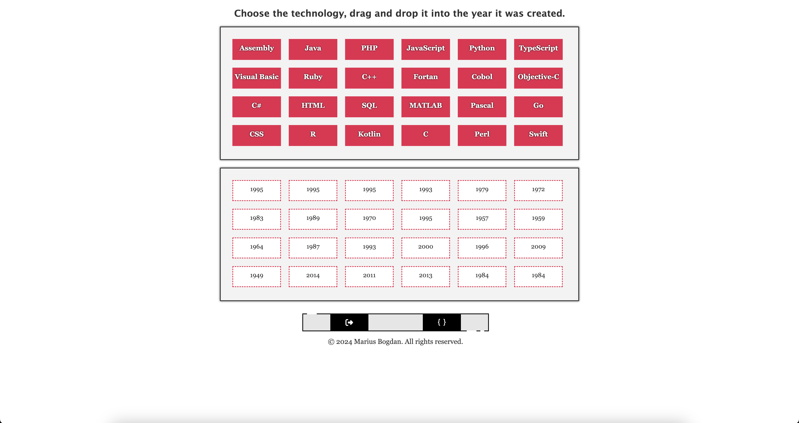

# Tech Year Drag-and-Drop Challenge

[](#)

> A fun and interactive game that challenges users to match technologies with the years they were created.

## Overview
**Tech Year Drag-and-Drop Challenge** is an engaging web-based game that allows users to drag and drop technology names into the correct year of creation. This project is designed to test and improve users' knowledge of programming history in an interactive and enjoyable way.

## Preview
<p align="center">
  
</p>

## Features
- **Drag-and-Drop Interaction:** Users can drag technology names and place them in the correct year.
- **Educational Gameplay:** A fun way to learn and test knowledge about programming history.
- **Instant Feedback:** Users receive visual cues when they place a technology in the right or wrong

## Live Demo
**Explore the live version here:** [View Live Demo](https://marius-bogdan.com/projects/tech-drag-drop/)

## Local Setup
1. **Clone** the repository:
   ```bash
   git clone https://github.com/MIBogdan/tech-drag-drop.git
   ```
2. **Open** the `index.html` file in your browser
   *- or use a local development server (like VS Code Live Server) for a smoother development experience.*

---

## Author
**Marius Bogdan**  
[Personal portfolio](https://marius-bogdan.com/)

Feel free to reach out for any questions or collaborations!

## License

This project is provided for testing and demonstration purposes only. All rights are reserved. No part of this project may be redistributed, reuploaded, or used in any manner (commercially or otherwise) without explicit written permission from the author.
